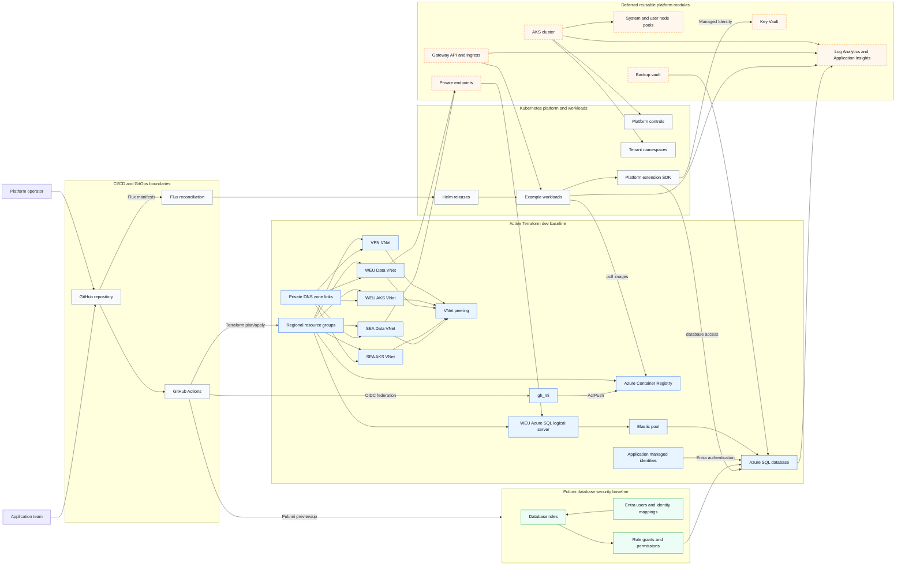

# Architecture

## Problem

Platform teams need a clear reference pattern for designing an Azure AKS foundation that separates infrastructure, identity, database security, application deployment, and operational documentation.

## Goals

- Demonstrate an Azure-first AKS platform blueprint.
- Use Terraform for cloud infrastructure.
- Use Pulumi for database security baselines.
- Prefer secure identity, private networking, observability, and maintainable documentation.
- Keep examples safe for public portfolio use.

## Non-goals

- This is not a complete enterprise production platform.
- This does not include proprietary client implementation details.
- This does not manage application database schema migrations.
- This does not deploy real production workloads.

## Architecture

The intended pattern separates Azure infrastructure, Kubernetes platform configuration, database security management, and application release responsibilities.

The active Terraform `dev` environment is now a network and SQL-focused baseline. It provisions regional resource groups, the VPN/WEU/SEA network layout, VNet peering, Private DNS zone links for SQL private endpoint resolution, the primary Azure SQL logical server, elastic pool, database, managed identities, and Azure Container Registry. The reusable modules for AKS, private endpoints, Key Vault, monitoring, and backup remain in `platform/infrastructure/modules/` as the next expansion layer for the platform blueprint.

The intended platform network pattern uses a shared VPN VNet plus regional AKS and data VNets. Data VNets host private endpoints, including future Azure SQL private endpoints. Private DNS links cover the VPN VNet and both regional AKS/data VNet pairs so platform workloads resolve Azure service names through private endpoint paths.

## Infrastructure Architecture

The overview Mermaid source diagram lives at `diagrams/infrastructure-architecture.mmd`. A Draw.io companion overview for manual editing and portfolio export lives at `diagrams/infrastructure-architecture.drawio`.

The polished portfolio Draw.io diagram for the Azure platform view lives at `diagrams/portfolio/Azure_platform.drawio`. Treat it as a presentation artifact for Azure icon styling and SVG/PNG export; the Mermaid files remain the technical source of truth.

Detailed architecture diagrams are split by concern:

- `diagrams/azure-platform-architecture.mmd`: Azure infrastructure baseline and deferred platform modules.
- `diagrams/networking-architecture.mmd`: VNet, subnet, AKS, ingress, private endpoint, private DNS, SQL, and planned edge networking topology.
- `diagrams/database-security-architecture.mmd`: Pulumi-managed database users, roles, grants, and identity mappings.
- `diagrams/iac-github-oidc-azure.mmd`: Infrastructure as Code flow from GitHub Actions to Azure through OIDC.
- `diagrams/helm-deployment-architecture.mmd`: Helm packaging, registry, and AKS release structure.
- `diagrams/gitops-workflow.mmd`: GitOps reconciliation workflow with Flux and Helm.

Portfolio Draw.io diagrams:

- `diagrams/portfolio/Azure_platform.drawio`: Polished Azure platform view for manual icon styling and export.
- `diagrams/portfolio/Azure_architecture.drawio`: Multi-region AKS networking and Azure SQL DR portfolio view.
- `diagrams/portfolio/AKS_workload_runtime.drawio`: Multi-tenant AKS workload runtime view showing shared Gateway, tenant namespace baselines, Flux HelmReleases, scaling, identity, data integration, and observability boundaries.

## AKS Workload Multi-tenancy

The Kubernetes layer follows a platform-owned, tenant-aware model. Platform configuration owns shared cluster concerns such as Gateway API infrastructure, platform add-ons, node provisioning, tenant namespace baselines, quotas, limit ranges, and default network policies. Application releases stay separate and are reconciled as Helm releases into tenant namespaces after the shared Gateway and tenant baseline exist.

The boutique sample uses separate tenant namespaces for development and production. Tenant namespaces carry explicit labels, including shared Gateway access labels, so HTTPRoute resources can attach to the shared public Gateway without giving every namespace implicit ingress access. This keeps the portfolio example simple while still showing the boundary between platform responsibilities and tenant workload ownership.

## Architecture Layers

- **Active Terraform baseline:** Provisions regional network foundations, VNet peering, SQL Private DNS links, Azure SQL primary infrastructure, managed identities, and ACR from `platform/infrastructure/environments/dev/`.
- **Deferred platform modules:** Keep the reusable AKS, private endpoint, Key Vault, monitoring, and backup module implementations ready for later environment composition.
- **Database security baseline:** Uses Pulumi under `platform/database-security/` to manage Entra users, role-oriented permissions, and database grants separately from Terraform.
- **Kubernetes and GitOps layer:** Keeps platform controls, tenant manifests, Gateway API resources, and Flux-managed application releases under `k8s/`.
- **Application integration layer:** Uses the platform extension SDK as a thin boundary for Managed Identity, Key Vault, database access, and telemetry wiring.

## Deployment Boundaries

- Terraform owns cloud infrastructure resources and managed identities.
- Pulumi owns database users, roles, grants, and identity mappings.
- Flux and Helm own Kubernetes application release state.
- Application pipelines own schema migrations and workload release logic.
- Documentation and diagrams describe the blueprint pattern and must be updated when these boundaries change.

## Components

- Azure resource groups, networking, AKS, Key Vault, Azure SQL server, elastic pool, databases, private endpoints, private DNS, backup vault, and monitoring live under `platform/infrastructure/`.
- Terraform infrastructure is currently organized around the network and SQL-focused `dev` environment, with reusable modules kept ready for later AKS environment composition.
- Database users, roles, grants, identity mappings, and connection references live under `platform/database-security/`.
- Application-facing platform SDK packages live under `platform/extension-sdk/`.
- Kubernetes platform controls live under `k8s/platform/`.
- Application Helm charts and Flux release manifests live under `k8s/apps/`.
- Portfolio website content lives under `platform/infrastructure/environments/portoflio-static-site/site/`.
- Application examples may live under `apps/`.
- Documentation lives under `docs/`.

## Security Considerations

- Prefer Managed Identity, Workload Identity, OIDC, and Key Vault references.
- Keep data services on private endpoints by default and disable public network access where practical.
- Link Private DNS zones to workload and operator VNets so private endpoints are usable through service FQDNs instead of hardcoded private IPs.
- Use managed identities for platform recovery components such as backup vaults.
- Avoid hardcoded credentials, tenant IDs, subscription IDs, private domains, production IPs, and kubeconfigs.
- Use least-privilege access and separate operational roles.

## Observability

The blueprint should include diagnostic settings, platform metrics, logs, alerts, and dashboard references as implementation matures. The reusable monitoring module currently models Log Analytics and Application Insights. Future AKS composition should connect AKS, ingress, workloads, and database diagnostics into that monitoring layer.

## Deployment Flow

1. Provision Azure infrastructure with Terraform.
2. Bootstrap cluster platform components and identity integrations.
3. Manage database security baselines with Pulumi.
4. Publish platform SDK artifacts to a private package registry.
5. Deploy applications through a separate application release pipeline.

## Rollback/Recovery

Rollback plans should distinguish between infrastructure replacement, Kubernetes configuration rollback, database security rollback, and application rollback.

## Trade-offs

- A blueprint keeps the repository easier to understand, but leaves implementation details for future phases.
- Separating database security from schema migration reduces coupling, but requires clear pipeline ownership.
- A platform SDK makes application integration easier, but it must stay thin so it does not become a shared business-logic library.
- Hosting the portfolio site from an isolated Static Web App Terraform root keeps documentation hosting independent from AKS platform lifecycle changes.
- Modeling Azure SQL Failover Group as an optional production/DR layer keeps the demo cost-aware while documenting the intended RTO/RPO trade-off.

## Future Improvements

- Instantiate the deferred AKS, private endpoint, Key Vault, monitoring, and backup modules from an environment root.
- Add optional Azure SQL geo-secondary and Failover Group composition for production-like DR validation.
- Expand Pulumi database security examples.
- Add rendered SVG or PNG exports for portfolio presentation pages.
- Add CI validation for diagram syntax and documentation consistency.
